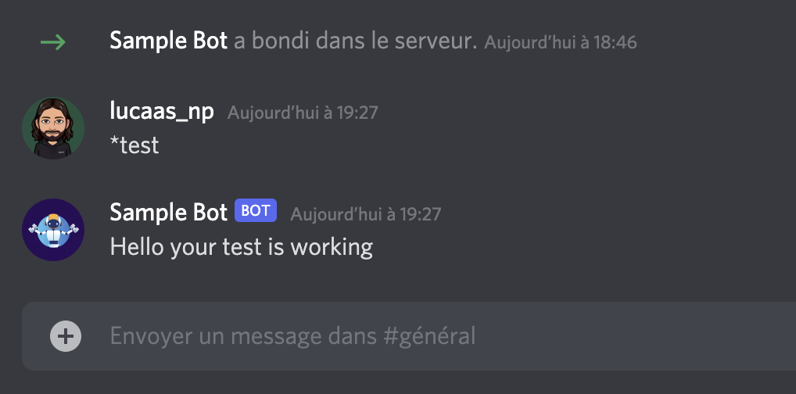

# sample-bot-discord
This is a sample bot for discord>



## Config
- Create a `local/env.sh`
- Export your discord Bot Token

<i>Example: </i> 

```
#!/bin/sh
export BOT_TOKEN="yourTokenHere"
```

## Usage

```
source local/env.sh
```

```
make run
```

```
make build
```

```
make exec
```